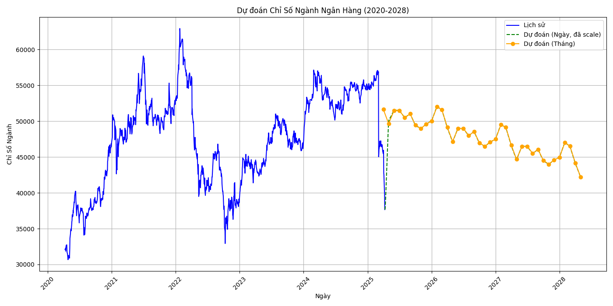

# Dự án Dự đoán Giá Cổ Phiếu (MBB, FPT, HAG, HPG, VNM)

## Tổng quan
Dự án này nhằm xây dựng hệ thống dự đoán giá cổ phiếu từ ngày 10/4/2025 đến 1/5/2028 cho 5 cổ phiếu mục tiêu: **MBB**, **FPT**, **HAG**, **HPG**, và **VNM**. Hệ thống sử dụng mô hình **Prophet** (dự đoán giá đầu tháng) và **LSTM** (dự đoán giá ngày), tích hợp các yếu tố:
- **Chỉ số thị trường**: S&P 500 và VNINDEX.
- **Chỉ số ngành**: Tính từ các cổ phiếu cùng ngành.
- **Chỉ số tài chính**: Dữ liệu từ báo cáo tài chính (Tổng Tài Sản, Tiền Mặt, Tổng Nợ, Tổng Vốn Sở Hữu, Lợi Tức Giữ Lại).

Dự án được thực hiện trong 2 ngày, bao gồm xử lý dữ liệu, xây dựng mô hình, và trực quan hóa kết quả.

[](https://www.python.org/)
[](https://opensource.org/licenses/MIT)

## Mục lục
- [Cấu trúc thư mục](#cấu-trúc-thư-mục)
- [Quy trình thực hiện](#quy-trình-thực-hiện)
  - [Bước 1: Xử lý và dự đoán S&P 500 và VNINDEX](#bước-1-xử-lý-và-dự-đoán-s&p-500-và-vnindex)
  - [Bước 2: Xử lý và dự đoán chỉ số ngành](#bước-2-xử-lý-và-dự-đoán-chỉ-số-ngành)
  - [Bước 3: Xử lý chỉ số báo cáo tài chính](#bước-3-xử-lý-chỉ-số-báo-cáo-tài-chính)
  - [Bước 4: Tích hợp các chỉ số và dự đoán cổ phiếu đích](#bước-4-tích-hợp-các-chỉ-số-và-dự-đoán-cổ-phiếu-đích)
  - [Bước 5: Đánh giá và cải thiện](#bước-5-đánh-giá-và-cải-thiện)
- [Cách chạy code](#cách-chạy-code)
- [Thông tin bổ sung](#thông-tin-bổ-sung)
- [Liên hệ](#liên-hệ)

## Cấu trúc thư mục
Dự án được tổ chức với cấu trúc sau:

### Nằm ngoài
- `SP500_Full_Predictions_2015_2028.csv`, `VNINDEX_Full_Predictions_2015_2028.csv`: Dự đoán S&P 500 và VNINDEX.
- `S&P500 & VNINDEX.ipynb`: Notebook dự đoán S&P 500 và VNINDEX.
- `Vốn hóa thị trường.txt`: Thông tin vốn hóa thị trường của các cổ phiếu.
- `Industry Index Prediction.py`: Script dự đoán chỉ số ngành.
- `MBB Prediction with Industry Index and Financial Data.py`: Script dự đoán cổ phiếu MBB (các cổ phiếu khác tương tự).

### Thư mục con (ví dụ: `MBB/`, tương tự cho FPT, HAG, HPG, VNM)
- `MBB.csv`: Dữ liệu giá lịch sử của MBB.
- `Dữ liệu Lịch sử BID 245.4T.csv`, `Dữ liệu Lịch sử VCB 481.29T.csv`, ...: Dữ liệu các cổ phiếu cùng ngành (Ngân hàng: BID, VCB, CTG, TCB).
- `MBB_Daily_Processed.csv`, `MBB_Monthly_Processed.csv`: Dữ liệu đã xử lý.
- `MBB_Full_Predictions_2020_2028.csv`: Kết quả dự đoán.
- `MBB_Prediction_Chart_Full.png`, `MBB_Prediction_Chart_Detail_2025_2028.png`: Biểu đồ dự đoán.

### Cổ phiếu cùng ngành
- **Ngân hàng (MBB)**: BID, VCB, CTG, TCB.
- **Công nghệ (FPT)**: CMG, SGT, ELC.
- **Nguyên vật liệu - Nông nghiệp (HAG)**: DBC, BAF, LTG, PAN.
- **Nguyên vật liệu - Thép (HPG)**: HSG, NKG, HT1, TLH.
- **Thực phẩm đồ uống (VNM)**: SAB, KDC, SBT, BHN.

### Vốn hóa thị trường (từ `Vốn hóa thị trường.txt`)
- MBB: 141.88T, BID: 245.4T, CTG: 201.91T, TCB: 190.04T, VCB: 481.29T.
- FPT: 161.38T, CMG: 7.06T, ELC: 2.18T, SGT: 2.68T.
- HAG: 13.9T, BAF: 10.63T, DBC: 9.22T, LTG: 2318.8B, PAN: 4.82T.
- HPG: 162.46T, HSG: 9T, HT1: 4.16T, NKG: 5.51T, TLH: 624.5B.
- VNM: 119.55T, BHN: 8.81T, KDC: 16.2T, SAB: 61.88T, SBT: 13.6T.

## Quy trình thực hiện

### Bước 1: Xử lý và dự đoán S&P 500 và VNINDEX
- **Mục tiêu**: Dự đoán chỉ số S&P 500 và VNINDEX từ 2015-2028 để làm đặc trưng đầu vào.
- **File liên quan**:
  - `SP500_DAY.csv`, `SP500_MONTH.csv`: Dữ liệu lịch sử S&P 500.
  - `VNINDEX_DAY.csv`, `VNINDEX_MONTH.csv`: Dữ liệu lịch sử VNINDEX.
  - `S&P500 & VNINDEX.ipynb`: Notebook xử lý và dự đoán.
- **Quy trình**:
  1. Đọc dữ liệu lịch sử từ 2015-2025.
  2. Dùng **Prophet** để dự đoán giá đầu tháng từ 2025-2028.
  3. Dùng **LSTM** (cửa sổ trượt `time_step=300`) để dự đoán giá ngày.
  4. Scale giá ngày để khớp với giá đầu tháng từ Prophet.
  5. Lưu kết quả:
     - `SP500_Full_Predictions_2015_2028.csv`.
     - `VNINDEX_Full_Predictions_2015_2028.csv`.
  6. Trực quan hóa:
     - 
     -  (tổng quan 2015-2028).
     - 
     -  (chi tiết 2025-2028).

### Bước 2: Xử lý và dự đoán chỉ số ngành
- **Mục tiêu**: Tính và dự đoán chỉ số ngành để làm đặc trưng đầu vào.
- **File liên quan**:
  - `Dự đoán chỉ số ngành.py`: Script dự đoán chỉ số ngành.
  - Ví dụ với ngành Ngân hàng (MBB, BID, VCB, CTG, TCB):
    - `MBB.csv`, `Dữ liệu Lịch sử BID 245.4T.csv`, ...
- **Quy trình**:
  1. Đọc dữ liệu cổ phiếu cùng ngành (lịch sử từ 10/4/2020 đến 9/4/2025).
  2. Tính chỉ số ngành (trung bình đơn giản giá cổ phiếu).
  3. Dùng **Prophet** để dự đoán giá đầu tháng chỉ số ngành từ 10/4/2025 đến 1/5/2028.
  4. Dùng **LSTM** để dự đoán giá ngày, scale để khớp với giá đầu tháng.
  5. Lưu kết quả:
     - `Banking_Industry_Historical.csv`: Dữ liệu lịch sử.
     - `Banking_Industry_Monthly_Forecast.csv`: Dự đoán đầu tháng.
     - `Banking_Industry_Daily_Predictions.csv`: Dự đoán ngày.
  6. Trực quan hóa:
     - .

- **Lặp lại** cho các ngành:
  - Công nghệ (FPT, CMG, SGT, ELC).
  - Nguyên vật liệu - Nông nghiệp (HAG, DBC, BAF, LTG, PAN).
  - Nguyên vật liệu - Thép (HPG, HSG, NKG, HT1, TLH).
  - Thực phẩm đồ uống (VNM, SAB, KDC, SBT, BHN).

### Bước 3: Xử lý chỉ số báo cáo tài chính
- **Mục tiêu**: Tích hợp các chỉ số tài chính vào mô hình dự đoán.
- **Dữ liệu**: File `MBB.xlsx` với cấu trúc:
  - Cột: `Cuối Kỳ` (2021-2024), các chỉ số tài chính.
  - Dữ liệu hàng năm (5 mốc: 01/01/2021, 01/01/2022, ..., 31/12/2024).
- **Quy trình**:
  1. Đọc và chuyển đổi dữ liệu thành dạng dài.
  2. Nội suy tuyến tính từ 01/01/2021 đến 31/12/2024 để tạo dữ liệu ngày.
  3. Kéo dài giá trị cuối (31/12/2024) cho 2025-2028.
  4. Ghép vào dữ liệu giá cổ phiếu.

- **Chỉ số chọn lọc**:
  - **Tổng Tài Sản**: Phản ánh quy mô tài chính.
  - **Tiền Mặt và Các Khoản Tương Đương Tiền Mặt**: Phản ánh thanh khoản.
  - **Tổng Nợ Phải Trả**: Phản ánh rủi ro tài chính.
  - **Tổng Vốn Sở Hữu**: Phản ánh sức khỏe tài chính.
  - **Lợi Tức Giữ Lại**: Phản ánh lợi nhuận tích lũy.

### Bước 4: Tích hợp các chỉ số và dự đoán cổ phiếu đích
- **Mục tiêu**: Dự đoán giá cổ phiếu MBB, FPT, HAG, HPG, VNM.
- **File liên quan**:
  - `MBB.py`: Script dự đoán MBB.
- **Quy trình**:
  1. **Xử lý dữ liệu** (ví dụ: MBB):
     - Đọc `MBB.csv` (2020-2025).
     - Ghép với S&P 500, VNINDEX, và chỉ số ngành.
     - Ghép với dữ liệu tài chính đã nội suy.
     - Lưu: `MBB_Daily_Processed.csv`, `MBB_Monthly_Processed.csv`.

  2. **Dự đoán giá đầu tháng bằng Prophet**:
     - Dữ liệu lịch sử (2020-2025) với các đặc trưng.
     - Dự đoán 2025-2028.

  3. **Dự đoán giá ngày bằng LSTM**:
     - Cửa sổ trượt `time_step=300`.
     - Scale giá ngày để khớp với giá đầu tháng.
     - Lưu: `MBB_Full_Predictions_2020_2028.csv`.

  4. **Trực quan hóa**:
     - 
     - .

- **Lặp lại**:
  - FPT: Chỉ số ngành Công nghệ.
  - HAG: Chỉ số ngành Nguyên vật liệu - Nông nghiệp.
  - HPG: Chỉ số ngành Nguyên vật liệu - Thép.
  - VNM: Chỉ số ngành Thực phẩm đồ uống.

### Bước 5: Đánh giá và cải thiện
- **Đánh giá**: Dự đoán 10/4/2025-10/5/2025.
- **Cải thiện**:
  - Thêm yếu tố vĩ mô (lãi suất, tỷ giá).
  - Thử nghiệm chỉ số tài chính khác (EPS, Dividend Yield).

## Cách chạy code
### Yêu cầu
- Python 3.8+
- Thư viện: `pandas`, `numpy`, `prophet`, `torch`, `matplotlib`, `scikit-learn`.
- Cài đặt:
  ```bash
  pip install pandas numpy prophet torch matplotlib scikit-learn
  ```

### Hướng dẫn chạy
1. **Dự đoán S&P 500 và VNINDEX**:
   - Mở `S&P500 & VNINDEX.ipynb`.
   - Chạy từng cell.

2. **Dự đoán chỉ số ngành**:
   - Chạy `Dự đoán chỉ số ngành.ipynb`:
     ```bash
     chạy từng cell
     ```
   - Lặp lại cho các ngành khác.

3. **Dự đoán cổ phiếu đích**:
   - Chạy `MBB.ipynb`:
     ```bash
     chạy từng cell
     ```
   - Lặp lại cho FPT, HAG, HPG, VNM.

## Thông tin bổ sung
- **Thời gian thực hiện**: 2 ngày.
- **Nguồn dữ liệu**:
  - Giá cổ phiếu: [Investing](https://vn.investing.com/).
  - S&P 500, VNINDEX: Investing.
  - Báo cáo tài chính: Investing.
- **Hạn chế**:
  - Dữ liệu tài chính chỉ đến 2024, dùng giá trị cuối cho 2025-2028.
  - Chỉ số ngành chưa có trọng số động.

## Liên hệ
- **Người thực hiện**: Nhóm ...
- **Email**: 
- **GitHub**: 
